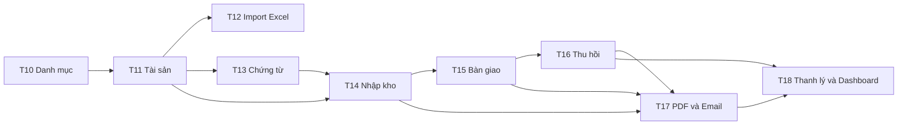

# Cursor Task Plan — ITAM Prototype T10–T18

## 1. Mục đích

File này là danh sách công việc bắt buộc để Cursor/AI theo dõi và triển khai các task T10–T18 của ITAM Prototype.

Cursor phải:

1. Đọc `AI_CODING_GUIDELINES.md` trước khi code.
2. Đọc task hiện tại trong file này.
3. Chỉ làm một task trên một branch.
4. Không tự triển khai task tiếp theo.
5. Cập nhật checklist và trạng thái sau khi hoàn tất.
6. Không tự merge, push hoặc xóa branch nếu người dùng chưa yêu cầu.

## 2. Nguồn nghiệp vụ

Thứ tự ưu tiên:

1. Yêu cầu trực tiếp mới nhất của người dùng.
2. Quyết định đã xác nhận trong dự án.
3. BRD ITAM.
4. File Yêu cầu nghiệp vụ để tham khảo bản chất quy trình.
5. Kế hoạch prototype 6 tháng.

Các quyết định đã chốt:

- Không có role FIN.
- Không có bước FIN giả lập trong nhập kho.
- Nhập kho theo luồng `PUR → IT`.
- Chỉ Admin duyệt hoặc từ chối thanh lý.
- PUR/Kế toán chỉ nhận thông báo thanh lý.
- T12 được bổ sung vào phạm vi prototype.
- T17 chưa làm QR Code hoặc tem tài sản.

## 3. Quy ước trạng thái task

| Trạng thái | Ý nghĩa |
|---|---|
| `NOT_STARTED` | Chưa bắt đầu. |
| `IN_PROGRESS` | Đang thực hiện trên branch riêng. |
| `BLOCKED` | Bị chặn bởi quyết định hoặc phụ thuộc chưa hoàn tất. |
| `READY_FOR_REVIEW` | Code và test xong, đang chờ review. |
| `DONE` | Pull Request đã review và merge. |

Cursor chỉ đánh dấu `DONE` khi task đã được merge. Nếu mới code và test xong, dùng `READY_FOR_REVIEW`.

## 4. Quy tắc Git

```text
1 task = 1 branch = 1 Pull Request
```

| Task | Branch đề xuất |
|---|---|
| T10 | `feature/T10-catalog-crud` |
| T11 | `feature/T11-hardware-assets` |
| T12 | `feature/T12-excel-import` |
| T13 | `feature/T13-documents` |
| T14 | `feature/T14-receiving-workflow` |
| T15 | `feature/T15-handover-workflow` |
| T16 | `feature/T16-recovery-workflow` |
| T17 | `feature/T17-pdf-email` |
| T18 | `feature/T18-disposal-dashboard` |

Quy tắc:

- Tạo branch từ `develop`, trừ khi repository có quy ước khác.
- Không code trực tiếp trên `main` hoặc `develop`.
- Không trộn nhiều task trong một branch.
- Không sửa file ngoài phạm vi task nếu không cần.
- Không thay version dependency tùy tiện.
- Không tự merge Pull Request.
- Pull Request phải ghi mã task và kết quả test.

## 5. Thứ tự và phụ thuộc



T12 và T13 có thể thực hiện song song sau T11 nếu dùng branch riêng và không sửa cùng vùng code.

## 6. Bảng tổng hợp

| Task | Nội dung | Thời gian | Trạng thái |
|---|---|---|---|
| T10 | CRUD danh mục | Tháng 3 | `NOT_STARTED` |
| T11 | Quản lý tài sản phần cứng | Tháng 3–4 | `NOT_STARTED` |
| T12 | Import Excel và validation | Tháng 4 | `NOT_STARTED` |
| T13 | Hồ sơ và chứng từ mẫu | Tháng 4 | `NOT_STARTED` |
| T14 | Workflow nhập kho PUR → IT | Tháng 4 | `NOT_STARTED` |
| T15 | Workflow bàn giao | Tháng 5 | `NOT_STARTED` |
| T16 | Workflow thu hồi và Smart Check | Tháng 5 | `NOT_STARTED` |
| T17 | PDF và email giả lập, không QR | Tháng 5 | `NOT_STARTED` |
| T18 | Thanh lý và dashboard | Tháng 6 | `NOT_STARTED` |

---

# T10 — CRUD danh mục

## Thông tin

- **Thời gian:** Tháng 3.
- **Branch:** `feature/T10-catalog-crud`.
- **Phụ thuộc:** Cấu trúc backend, PostgreSQL và Flyway đã hoạt động.
- **Trạng thái:** `NOT_STARTED`.

## Mục tiêu

Phát triển chức năng quản lý các danh mục dùng chung:

- Phòng ban.
- Vị trí.
- Model.
- Loại tài sản.
- Nhóm tài sản nếu schema sử dụng.
- Trạng thái tài sản.
- Tình trạng tài sản.
- Nhà cung cấp.
- Loại license.

## Backend checklist

- [ ] Tạo Flyway migration cho các bảng danh mục.
- [ ] Tạo Entity và Repository cần thiết.
- [ ] Tạo request/response DTO.
- [ ] Tạo Service xử lý CRUD.
- [ ] Tạo Controller REST.
- [ ] Kiểm tra trùng tên hoặc mã phù hợp từng danh mục.
- [ ] Chặn xóa danh mục đang được asset hoặc dữ liệu khác tham chiếu.
- [ ] Có phân trang cho danh mục có thể tăng lớn.
- [ ] Có tìm kiếm theo tên.
- [ ] Không trả Entity trực tiếp qua API.
- [ ] Áp dụng phân quyền hiện tại của dự án.

## Frontend checklist

- [ ] Trang danh sách danh mục.
- [ ] Form thêm và sửa.
- [ ] Dialog xác nhận xóa.
- [ ] Hiển thị lỗi danh mục đang được sử dụng.
- [ ] Loading, empty state và error state.
- [ ] API đặt trong `features/catalogs/api`.
- [ ] Component riêng của danh mục đặt trong `features/catalogs`.

## Acceptance criteria

- [ ] Tạo, xem, sửa và xóa được danh mục chưa được tham chiếu.
- [ ] Không xóa được danh mục đang được sử dụng.
- [ ] Không tạo bản ghi trùng theo unique rule.
- [ ] API sai quyền bị từ chối.
- [ ] Migration chạy được trên database trống.
- [ ] Backend test thành công.
- [ ] Frontend build thành công.

## Không làm trong T10

- Không tạo tài sản.
- Không làm workflow nhập kho.
- Không thêm role FIN.
- Không tạo báo cáo.

---

# T11 — Quản lý tài sản phần cứng

## Thông tin

- **Thời gian:** Tháng 3–4.
- **Branch:** `feature/T11-hardware-assets`.
- **Phụ thuộc:** T10.
- **Trạng thái:** `NOT_STARTED`.

## Mục tiêu

Cho phép tạo, sửa, xem, tìm kiếm và lọc tài sản phần cứng; xử lý Asset Tag, Serial Number và cấu hình Default/Actual.

## Backend checklist

- [ ] Tạo bảng `assets` và bảng chi tiết phần cứng bằng Flyway.
- [ ] Liên kết asset với loại, model, trạng thái, tình trạng, vị trí, phòng ban và nhà cung cấp.
- [ ] Tạo Asset Entity và Hardware Detail Entity.
- [ ] Tạo request/response DTO.
- [ ] Tạo Asset Mapper.
- [ ] Tạo Asset Repository và Specification hoặc query phù hợp.
- [ ] Tạo Asset Service.
- [ ] Tạo Asset Controller.
- [ ] Asset Tag phải unique khi có giá trị.
- [ ] Serial Number phải unique khi có giá trị.
- [ ] Giá mua không được âm.
- [ ] Actual CPU/RAM/Storage/GPU được phép rỗng.
- [ ] Khi Actual rỗng, response trả cấu hình hiệu lực từ Default của model.
- [ ] Có phân trang.
- [ ] Tìm kiếm theo Asset Tag, tên và Serial Number.
- [ ] Lọc theo loại, trạng thái, vị trí, phòng ban và model.
- [ ] Không hard-delete asset đã có lịch sử hoặc giao dịch.

## Frontend checklist

- [ ] Trang danh sách tài sản.
- [ ] Tìm kiếm và bộ lọc.
- [ ] Phân trang.
- [ ] Trang chi tiết tài sản.
- [ ] Form tạo và cập nhật tài sản.
- [ ] Hiển thị Default và Actual riêng biệt.
- [ ] Hiển thị cấu hình hiệu lực.
- [ ] Hiển thị lỗi trùng Asset Tag hoặc Serial Number.

## Acceptance criteria

- [ ] Tạo phần cứng hợp lệ thành công.
- [ ] Chặn Asset Tag trùng.
- [ ] Chặn Serial Number trùng.
- [ ] Actual rỗng dùng đúng Default.
- [ ] Tìm kiếm và lọc trả đúng kết quả.
- [ ] Không có lỗi N+1 rõ ràng ở trang danh sách.
- [ ] API không trả JPA Entity trực tiếp.
- [ ] Backend test thành công.
- [ ] Frontend build thành công.

## Không làm trong T11

- Không bàn giao hoặc thu hồi.
- Không Import Excel.
- Không sinh PDF.
- Không làm QR.

---

# T12 — Import Excel và validation

## Thông tin

- **Thời gian:** Tháng 4.
- **Branch:** `feature/T12-excel-import`.
- **Phụ thuộc:** T10 và T11.
- **Nguồn:** Task bổ sung từ kế hoạch/yêu cầu nghiệp vụ; không thay đổi workflow BRD.
- **Trạng thái:** `NOT_STARTED`.

## Mục tiêu

Cho phép upload Excel, preview, kiểm tra dữ liệu theo dòng, phát hiện trùng và import các dòng hợp lệ.

## Backend checklist

- [ ] Chỉ chấp nhận định dạng Excel được cấu hình.
- [ ] Giới hạn kích thước file và số dòng.
- [ ] Cung cấp file template hoặc định nghĩa cột rõ ràng.
- [ ] API preview không ghi dữ liệu vào database.
- [ ] Kiểm tra cột bắt buộc.
- [ ] Kiểm tra kiểu dữ liệu từng ô.
- [ ] Kiểm tra danh mục tham chiếu tồn tại.
- [ ] Kiểm tra Asset Tag trùng trong file.
- [ ] Kiểm tra Serial Number trùng trong file.
- [ ] Kiểm tra trùng với database.
- [ ] Trả lỗi theo số dòng, tên cột và nguyên nhân.
- [ ] API confirm chỉ import những dòng hợp lệ đã được xác nhận.
- [ ] Import chạy trong transaction phù hợp.
- [ ] Ghi người import, thời gian và kết quả.
- [ ] Không lưu file tạm vĩnh viễn nếu không cần.

## Frontend checklist

- [ ] Màn hình upload Excel.
- [ ] Link tải template nếu có.
- [ ] Bảng preview.
- [ ] Phân biệt dòng hợp lệ và không hợp lệ.
- [ ] Hiển thị lỗi từng dòng.
- [ ] Hiển thị tổng số hợp lệ, lỗi và trùng.
- [ ] Chỉ bật nút import khi có dòng hợp lệ.
- [ ] Hiển thị kết quả sau import.

## Acceptance criteria

- [ ] Preview không thay đổi database.
- [ ] File sai định dạng bị từ chối.
- [ ] Lỗi hiển thị đúng dòng và cột.
- [ ] Không import Asset Tag hoặc Serial Number trùng.
- [ ] Chỉ dòng hợp lệ được import.
- [ ] Import lỗi giữa chừng không để dữ liệu nửa vời theo chiến lược transaction đã chọn.
- [ ] Có test file hợp lệ, file lỗi và file trùng.

## Không làm trong T12

- Không tự động tạo danh mục không tồn tại.
- Không đồng bộ Excel hai chiều.
- Không export báo cáo.

---

# T13 — Quản lý hồ sơ và chứng từ mẫu

## Thông tin

- **Thời gian:** Tháng 4.
- **Branch:** `feature/T13-documents`.
- **Phụ thuộc:** T11.
- **Trạng thái:** `NOT_STARTED`.

## Mục tiêu

Upload file an toàn, lưu metadata, liên kết document với phiếu và hỗ trợ liên kết asset để tra cứu.

## Backend checklist

- [ ] Tạo bảng `documents` bằng Flyway.
- [ ] Document có `transaction_id` theo BRD.
- [ ] `asset_id` là liên kết tùy chọn để tra cứu nhanh nếu schema dùng.
- [ ] Lưu tên gốc, tên lưu, loại file, đường dẫn, kích thước, người upload và thời gian.
- [ ] Kiểm tra extension và MIME type.
- [ ] Giới hạn kích thước file.
- [ ] Tạo tên file an toàn và duy nhất.
- [ ] Chống path traversal.
- [ ] Không dùng tên file người dùng gửi làm đường dẫn trực tiếp.
- [ ] Phân thư mục local theo loại phiếu.
- [ ] API upload, xem metadata và download.
- [ ] Kiểm tra quyền download.
- [ ] Ghi audit khi upload hoặc xóa file chưa được sử dụng.
- [ ] Không hard-delete metadata của document thuộc phiếu đã hoàn tất.

## Frontend checklist

- [ ] Component upload file.
- [ ] Hiển thị tiến trình hoặc trạng thái upload.
- [ ] Hiển thị danh sách document của phiếu.
- [ ] Download document theo quyền.
- [ ] Hiển thị lỗi loại file và kích thước.

## Acceptance criteria

- [ ] File hợp lệ upload thành công.
- [ ] File không hợp lệ bị từ chối.
- [ ] Không thể ghi file ra ngoài thư mục storage.
- [ ] Metadata liên kết đúng transaction.
- [ ] Người sai quyền không download được.
- [ ] Không sử dụng chứng từ thật trong dữ liệu demo.

## Không làm trong T13

- Không sinh PDF tự động; thuộc T17.
- Không gửi email.
- Không làm chữ ký điện tử.

---

# T14 — Workflow nhập kho PUR → IT

## Thông tin

- **Thời gian:** Tháng 4.
- **Branch:** `feature/T14-receiving-workflow`.
- **Phụ thuộc:** T10, T11 và T13.
- **Trạng thái:** `NOT_STARTED`.

## Mục tiêu đã sửa theo BRD

PUR tạo phiếu nhập kho và cung cấp chứng từ. IT kiểm tra, duyệt hoặc từ chối. Không có FIN, không có bước FIN giả lập và không có bước FIN cấp mã.

## Luồng chính

```text
PUR tạo IMPORT/PENDING
→ PUR nhập thông tin và upload chứng từ
→ PUR thêm nhiều asset
→ IT kiểm tra
→ IT duyệt
→ IMPORT/COMPLETED
→ asset chuyển IN_STOCK
→ ghi lịch sử
```

## Luồng từ chối

```text
IT nhập lý do từ chối
→ IMPORT/REJECTED
→ asset chưa được đưa vào kho khả dụng
→ PUR xem được lý do
```

## Backend checklist

- [ ] Tạo Entity `AssetTransaction` và `TransactionAsset` nếu chưa có.
- [ ] Tạo enum `IMPORT`, `PENDING`, `COMPLETED`, `REJECTED`.
- [ ] PUR tạo phiếu nhập.
- [ ] PUR thêm nhiều asset vào phiếu.
- [ ] PUR liên kết document đã upload.
- [ ] IT xem phiếu đang chờ.
- [ ] IT xem thông tin asset và document.
- [ ] IT duyệt phiếu.
- [ ] IT từ chối và bắt buộc nhập lý do.
- [ ] Không role FIN trong Entity, DTO, Security hoặc UI.
- [ ] Duyệt cập nhật phiếu và tất cả asset trong cùng `@Transactional`.
- [ ] Duyệt chuyển asset thành `IN_STOCK`.
- [ ] Từ chối không đưa asset vào kho khả dụng.
- [ ] Chặn duyệt hoặc từ chối phiếu đã kết thúc.
- [ ] Ghi actor, thời gian và lịch sử.
- [ ] Chuẩn bị điểm tích hợp PDF/email cho T17 nhưng chưa cần triển khai.

## Frontend checklist

- [ ] PUR có trang tạo phiếu nhập.
- [ ] PUR thêm nhiều asset.
- [ ] PUR upload/xem document.
- [ ] PUR xem trạng thái phiếu.
- [ ] IT có danh sách phiếu `PENDING`.
- [ ] IT xem chi tiết.
- [ ] IT có nút duyệt và từ chối.
- [ ] Dialog từ chối bắt buộc lý do.
- [ ] Không có màn hình hoặc nút FIN.

## Acceptance criteria

- [ ] PUR tạo phiếu thành công.
- [ ] IT duyệt thành công.
- [ ] Asset chuyển `IN_STOCK` sau duyệt.
- [ ] IT từ chối thành công với lý do.
- [ ] PUR không thể tự duyệt.
- [ ] User không thể tạo hoặc duyệt phiếu.
- [ ] Không có code FIN hoặc accounting approval.
- [ ] Lỗi cập nhật một asset rollback toàn bộ phê duyệt.

## Điểm cần kiểm tra trước khi code

BRD chưa xác định trạng thái asset trước khi IT duyệt. Cursor không được tự thêm `PENDING_IMPORT` nếu chưa được người dùng xác nhận. Phải dùng mô hình hiện có hoặc báo `BLOCKED` nếu schema không thể biểu diễn đúng.

---

# T15 — Workflow bàn giao

## Thông tin

- **Thời gian:** Tháng 5.
- **Branch:** `feature/T15-handover-workflow`.
- **Phụ thuộc:** T11 và T14.
- **Trạng thái:** `NOT_STARTED`.

## Mục tiêu

IT chọn một hoặc nhiều asset trong kho, chọn một User nhận, hoàn tất bàn giao, cập nhật trạng thái và ghi lịch sử.

## Luồng chính

```text
IT chọn asset IN_STOCK
→ chọn một User
→ tạo HANDOVER/COMPLETED
→ asset chuyển IN_USE
→ assigned_to = User
→ ghi lịch sử
```

## Backend checklist

- [ ] Chỉ IT hoặc Admin thực hiện bàn giao.
- [ ] Phiếu phải có ít nhất một asset.
- [ ] Một phiếu chỉ có một User nhận.
- [ ] Chỉ asset `IN_STOCK` được bàn giao.
- [ ] Asset không được có `assigned_to` trước khi bàn giao.
- [ ] Kiểm tra lại trạng thái trong transaction trước khi cập nhật.
- [ ] Tạo `HANDOVER/COMPLETED` theo BRD.
- [ ] Cập nhật toàn bộ asset thành `IN_USE`.
- [ ] Cập nhật `assigned_to`.
- [ ] Ghi lịch sử từng asset.
- [ ] Chuẩn bị tích hợp PDF/email cho T17.
- [ ] Không tự thêm asset con khi bàn giao nếu chưa được xác nhận.

## Frontend checklist

- [ ] Trang tạo bàn giao.
- [ ] Tìm kiếm và chọn nhiều asset `IN_STOCK`.
- [ ] Chọn một User.
- [ ] Bảng xem trước asset.
- [ ] Dialog xác nhận hoàn tất.
- [ ] Trang danh sách và chi tiết phiếu.
- [ ] Hiển thị lỗi nếu asset không còn khả dụng.

## Acceptance criteria

- [ ] Bàn giao nhiều asset thành công.
- [ ] Asset chuyển `IN_USE` và gán đúng User.
- [ ] Chặn asset không phải `IN_STOCK`.
- [ ] Chặn PUR và User gọi API bàn giao.
- [ ] Lỗi một asset rollback toàn bộ phiếu.
- [ ] Lịch sử phản ánh đúng người nhận và thời gian.

---

# T16 — Workflow thu hồi và Smart Check

## Thông tin

- **Thời gian:** Tháng 5.
- **Branch:** `feature/T16-recovery-workflow`.
- **Phụ thuộc:** T11 và T15.
- **Trạng thái:** `NOT_STARTED`.

## Mục tiêu đã sửa theo BRD

Thu hồi một hoặc nhiều asset từ User; xử lý đầy đủ quan hệ cha–con theo bốn kịch bản Smart Check; trả asset phù hợp về kho.

## Luồng tổng quát

```text
IT chọn User trả
→ nhập lý do
→ thêm asset
→ hệ thống chạy Smart Check
→ IT xác nhận danh sách
→ tạo RECOVERY/COMPLETED
→ cập nhật asset và quan hệ
→ ghi lịch sử
```

## Kịch bản A — Thu hồi asset cha

- [ ] Hệ thống tải toàn bộ asset con.
- [ ] Linh kiện được chọn bắt buộc.
- [ ] License OEM được chọn bắt buộc.
- [ ] License Per-User là tùy chọn.
- [ ] IT không thể bỏ chọn linh kiện hoặc OEM bắt buộc.
- [ ] Asset cha và asset con được chọn được thêm vào cùng một phiếu.

## Kịch bản B — Thu hồi riêng License Per-User

- [ ] Hiển thị asset cha đang liên kết.
- [ ] Yêu cầu IT xác nhận gỡ.
- [ ] Chỉ License Per-User được thêm vào phiếu.
- [ ] Xóa đúng quan hệ `INSTALLED_ON`.
- [ ] License chuyển `IN_STOCK`.
- [ ] `assigned_to = NULL`.

## Kịch bản C — Thu hồi riêng linh kiện

- [ ] Hiển thị cảnh báo xác nhận, không xem là lỗi.
- [ ] Chỉ linh kiện được thêm vào phiếu.
- [ ] Xóa đúng quan hệ `COMPONENT_OF`.
- [ ] Linh kiện chuyển `IN_STOCK`.
- [ ] `assigned_to = NULL`.
- [ ] Trạng thái asset cha không tự động thay đổi.

## Kịch bản D — Thu hồi riêng License OEM

- [ ] Hệ thống chặn thao tác.
- [ ] License OEM không được thêm vào phiếu.
- [ ] Thông báo yêu cầu chọn asset cha.
- [ ] Không thay đổi trạng thái hoặc quan hệ.

## Backend checklist

- [ ] Tạo hoặc hoàn thiện `AssetRelationship`.
- [ ] Hỗ trợ `COMPONENT_OF` và `INSTALLED_ON`.
- [ ] Tạo Recovery Service và Validator.
- [ ] Smart Check chạy ở backend, không chỉ frontend.
- [ ] Kiểm tra asset thuộc User đã chọn.
- [ ] Chặn asset trùng trong cùng phiếu.
- [ ] Hoàn tất tạo một phiếu cho toàn bộ asset.
- [ ] Cập nhật asset được thu hồi thành `IN_STOCK`.
- [ ] Xóa `assigned_to` của asset được thu hồi.
- [ ] Chỉ gỡ quan hệ cần thiết.
- [ ] Không xóa toàn bộ quan hệ của asset.
- [ ] Ghi lịch sử từng asset và quan hệ bị gỡ.
- [ ] Toàn bộ thao tác dùng `@Transactional`.
- [ ] Chuẩn bị tích hợp PDF/email cho T17.

## Frontend checklist

- [ ] Trang tạo phiếu thu hồi.
- [ ] Chọn User trả trước khi thêm asset.
- [ ] Tìm và thêm nhiều asset.
- [ ] Pop-up lớn cho asset cha.
- [ ] Pop-up xác nhận cho Per-User.
- [ ] Pop-up cảnh báo cho linh kiện.
- [ ] Thông báo lỗi chặn cho OEM.
- [ ] Hiển thị asset bắt buộc và tùy chọn khác nhau.
- [ ] Bảng tổng hợp trước khi hoàn tất.

## Acceptance criteria

- [ ] Đủ bốn kịch bản Smart Check.
- [ ] Không thu hồi riêng OEM.
- [ ] Per-User và linh kiện gỡ đúng quan hệ.
- [ ] Asset cha không tự đổi trạng thái khi thu hồi riêng linh kiện.
- [ ] Một lỗi rollback toàn bộ phiếu.
- [ ] Backend tự kiểm tra rule dù frontend bị bỏ qua.
- [ ] Có unit test cho từng Smart Check.
- [ ] Có integration test hoàn tất thu hồi.

## Quy tắc quan hệ tạm thời

Khi asset cha, linh kiện và OEM được thu hồi cùng nhau nhưng vẫn tiếp tục đi cùng nhau, không tự xóa các quan hệ đó. Chỉ gỡ quan hệ của asset được tách riêng. Nếu code hiện tại hoặc BRD chi tiết yêu cầu khác, đánh dấu `BLOCKED` và hỏi người dùng.

---

# T17 — PDF và email giả lập

## Thông tin

- **Thời gian:** Tháng 5.
- **Branch:** `feature/T17-pdf-email`.
- **Phụ thuộc:** T13–T16.
- **Trạng thái:** `NOT_STARTED`.

## Mục tiêu đã sửa

Sinh PDF mẫu cho các workflow và gửi email qua cơ chế local/sandbox hoặc giả lập.

**Không làm QR Code hoặc tem tài sản trong T17.**

## PDF checklist

- [ ] Tạo service sinh PDF dùng chung.
- [ ] Template PDF nhập kho.
- [ ] Template PDF bàn giao.
- [ ] Template PDF thu hồi.
- [ ] Thiết kế để T18 bổ sung PDF thanh lý.
- [ ] PDF có mã phiếu, loại phiếu, ngày và actor.
- [ ] PDF liệt kê đầy đủ asset trong phiếu.
- [ ] PDF hiển thị Asset Tag và Serial Number khi có.
- [ ] PDF lưu đúng thư mục theo loại nghiệp vụ.
- [ ] Metadata PDF được lưu vào `documents`.
- [ ] PDF liên kết đúng `transaction_id`.
- [ ] Cho phép tải lại PDF theo quyền.

## Email checklist

- [ ] Tạo Email Service abstraction đơn giản.
- [ ] Có implementation local/sandbox hoặc mock phù hợp môi trường hiện tại.
- [ ] Không bắt buộc hạ tầng MailHog hoặc Docker.
- [ ] Không hard-code SMTP password.
- [ ] Nhập kho thông báo PUR.
- [ ] Bàn giao thông báo User nhận.
- [ ] Thu hồi thông báo User trả.
- [ ] Email có thông tin phiếu và PDF hoặc đường dẫn phù hợp.
- [ ] Lỗi email được ghi log rõ.
- [ ] Lỗi email không làm sai trạng thái nghiệp vụ đã hoàn tất.

## Frontend checklist

- [ ] Hiển thị trạng thái tạo PDF.
- [ ] Nút tải PDF trên chi tiết phiếu.
- [ ] Hiển thị trạng thái gửi email giả lập.
- [ ] Hiển thị lỗi mà không làm người dùng hiểu nhầm giao dịch thất bại.

## Acceptance criteria

- [ ] Sinh được PDF nhập kho.
- [ ] Sinh được PDF bàn giao.
- [ ] Sinh được PDF thu hồi.
- [ ] PDF chứa đúng danh sách asset.
- [ ] Metadata liên kết đúng phiếu.
- [ ] Email giả lập được ghi nhận.
- [ ] Không có code QR hoặc thư viện QR được thêm trong task.
- [ ] Không yêu cầu Docker để demo.

## Không làm trong T17

- Không QR Code.
- Không tem tài sản.
- Không kiểm kê bằng QR.
- Không chữ ký điện tử.
- Không email production nếu chưa được cấu hình.

---

# T18 — Thanh lý và dashboard prototype

## Thông tin

- **Thời gian:** Tháng 6.
- **Branch:** `feature/T18-disposal-dashboard`.
- **Phụ thuộc:** T11, T13, T16 và T17.
- **Trạng thái:** `NOT_STARTED`.

## Mục tiêu

IT tạo phiếu thanh lý; hệ thống xử lý asset con; chỉ Admin duyệt hoặc từ chối; asset được soft-retire; dashboard hiển thị thống kê cơ bản.

## Luồng thanh lý

```text
IT chọn asset
→ hệ thống tự thêm linh kiện và OEM con
→ cảnh báo nếu còn Per-User
→ IT nhập lý do
→ tạo DISPOSAL/PENDING
→ Admin duyệt hoặc từ chối
```

## Backend checklist — Tạo phiếu

- [ ] IT hoặc Admin được tạo phiếu.
- [ ] Phiếu phải có ít nhất một asset.
- [ ] Lý do thanh lý bắt buộc.
- [ ] Chọn asset cha tự thêm linh kiện con.
- [ ] Chọn asset cha tự thêm License OEM con.
- [ ] Nếu còn Per-User, trả cảnh báo rõ.
- [ ] Chặn asset đang thuộc phiếu thanh lý `PENDING` khác.
- [ ] Tạo `DISPOSAL/PENDING`.
- [ ] Ghi người tạo và thời gian.

## Backend checklist — Phê duyệt

- [ ] Chỉ Admin được approve.
- [ ] Chỉ Admin được reject.
- [ ] IT, PUR và User gọi API approve/reject phải nhận `403`.
- [ ] Admin duyệt chuyển phiếu thành `COMPLETED`.
- [ ] Admin duyệt chuyển toàn bộ asset trong phiếu thành `RETIRED`.
- [ ] Khi `RETIRED`, `assigned_to` phải rỗng.
- [ ] Không hard-delete asset.
- [ ] Admin từ chối phải nhập lý do.
- [ ] Từ chối chuyển phiếu thành `REJECTED`.
- [ ] Từ chối không đổi trạng thái asset.
- [ ] Toàn bộ phê duyệt dùng `@Transactional`.
- [ ] Ghi lịch sử từng asset.

## PDF và thông báo

- [ ] Bổ sung template PDF thanh lý bằng service từ T17.
- [ ] PDF liệt kê toàn bộ asset, gồm asset tự động thêm.
- [ ] Lưu metadata PDF.
- [ ] Thông báo PUR/Kế toán sau khi duyệt.
- [ ] PUR/Kế toán chỉ nhận thông báo, không được duyệt.

## Dashboard checklist

- [ ] Tổng số asset theo trạng thái.
- [ ] Tổng số asset theo loại.
- [ ] Tổng số asset theo vị trí.
- [ ] Tổng số asset theo phòng ban.
- [ ] Số phiếu nhập đang `PENDING`.
- [ ] Số phiếu thanh lý đang `PENDING`.
- [ ] Chỉ Admin và IT xem dashboard chi tiết.
- [ ] PUR và User không xem dashboard chi tiết.
- [ ] Truy vấn thống kê không tải toàn bộ Entity vào memory.

## Frontend checklist

- [ ] IT có trang tạo phiếu thanh lý.
- [ ] Hiển thị asset con được tự thêm.
- [ ] Hiển thị cảnh báo Per-User.
- [ ] Admin có danh sách phiếu chờ duyệt.
- [ ] Admin có dialog approve/reject.
- [ ] Dialog reject bắt buộc lý do.
- [ ] PUR không thấy nút duyệt.
- [ ] Dashboard có loading, empty và error state.

## Acceptance criteria

- [ ] IT tạo phiếu thành công.
- [ ] Linh kiện và OEM được tự thêm đúng.
- [ ] Per-User tạo cảnh báo.
- [ ] Chỉ Admin duyệt hoặc từ chối được.
- [ ] Duyệt chuyển asset thành `RETIRED`.
- [ ] Từ chối giữ nguyên trạng thái asset.
- [ ] Không asset hoặc lịch sử nào bị hard-delete.
- [ ] PDF thanh lý được tạo.
- [ ] PUR/Kế toán nhận thông báo giả lập.
- [ ] Dashboard trả đúng số liệu cơ bản.
- [ ] Có authorization test cho approve/reject.
- [ ] Có integration test rollback.

---

# 7. Definition of Done chung

Mỗi task chỉ chuyển `READY_FOR_REVIEW` khi:

- [ ] Đúng phạm vi task.
- [ ] Không triển khai sớm task khác.
- [ ] Không thêm role FIN.
- [ ] Không làm QR trong T17.
- [ ] Migration mới chạy được trên database trống.
- [ ] Backend compile và test thành công.
- [ ] Frontend build thành công nếu bị ảnh hưởng.
- [ ] Validation và xử lý lỗi đầy đủ.
- [ ] Không có secret hoặc dữ liệu thật.
- [ ] Không hard-delete dữ liệu có lịch sử.
- [ ] Branch chỉ chứa thay đổi liên quan task.
- [ ] Pull Request ghi mã task, phạm vi và kết quả test.

Task chỉ chuyển `DONE` sau khi Pull Request được review và merge.

## 8. Lệnh kiểm tra tối thiểu

Backend:

```bash
cd backend
./mvnw test
```

Frontend:

```bash
cd frontend
npm run build
```

Git:

```bash
git status --short
git diff --stat
```

Cursor phải báo nguyên văn lỗi chính nếu lệnh thất bại. Không được đánh dấu task hoàn tất khi build hoặc test liên quan đang lỗi.

## 9. Nhật ký thực hiện

Cursor cập nhật bảng này sau mỗi task. Không xóa lịch sử cũ.

| Task | Branch | Trạng thái | Pull Request | Ngày | Ghi chú |
|---|---|---|---|---|---|
| T10 | `feature/T10-catalog-crud` | `NOT_STARTED` |  |  |  |
| T11 | `feature/T11-hardware-assets` | `NOT_STARTED` |  |  |  |
| T12 | `feature/T12-excel-import` | `NOT_STARTED` |  |  |  |
| T13 | `feature/T13-documents` | `NOT_STARTED` |  |  |  |
| T14 | `feature/T14-receiving-workflow` | `NOT_STARTED` |  |  | Không FIN. |
| T15 | `feature/T15-handover-workflow` | `NOT_STARTED` |  |  |  |
| T16 | `feature/T16-recovery-workflow` | `NOT_STARTED` |  |  | Bốn Smart Check. |
| T17 | `feature/T17-pdf-email` | `NOT_STARTED` |  |  | Không QR. |
| T18 | `feature/T18-disposal-dashboard` | `NOT_STARTED` |  |  | Chỉ Admin duyệt. |

## 10. Câu lệnh khởi đầu cho Cursor

Khi người dùng yêu cầu bắt đầu một task, Cursor phải làm theo mẫu:

```text
Đọc AI_CODING_GUIDELINES.md và CURSOR_TASK_PLAN_T10_T18.md.
Kiểm tra repository và git status.
Chỉ thực hiện task được yêu cầu trên branch tương ứng.
Không triển khai task tiếp theo.
Sau khi code, chạy test/build, cập nhật checklist và báo lại kết quả.
Không tự merge hoặc push.
```
